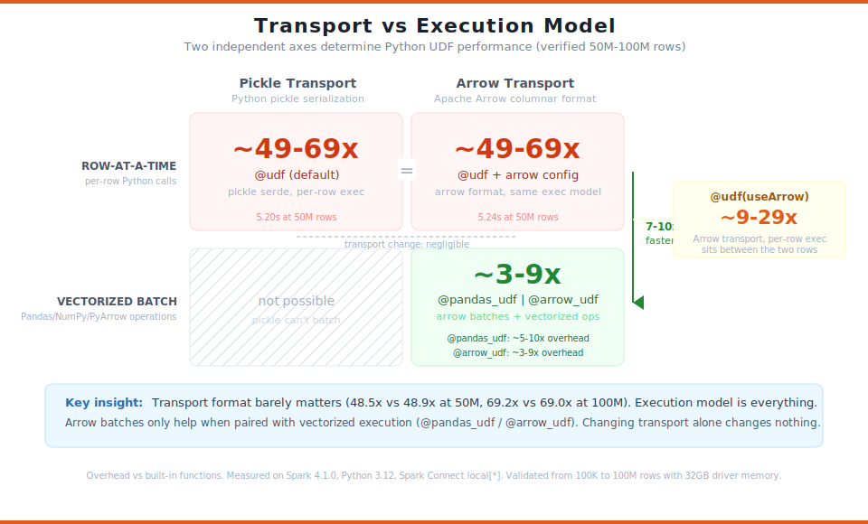
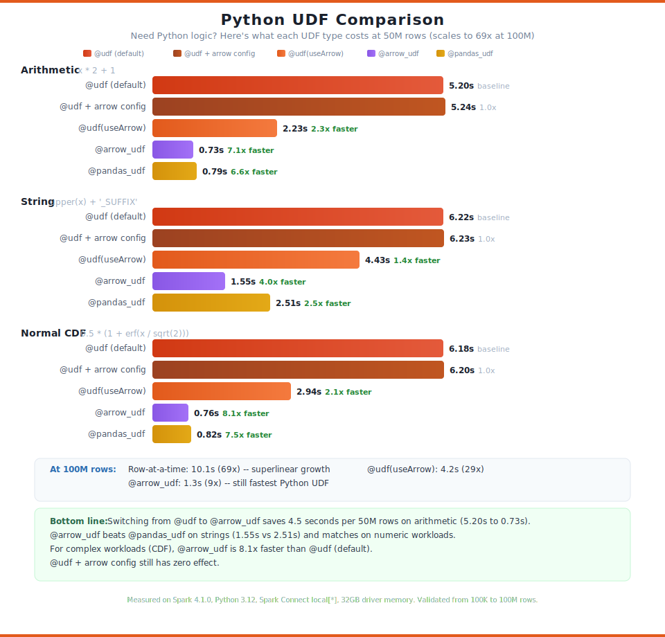
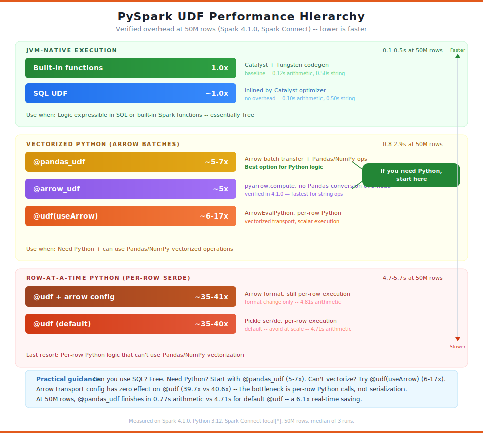
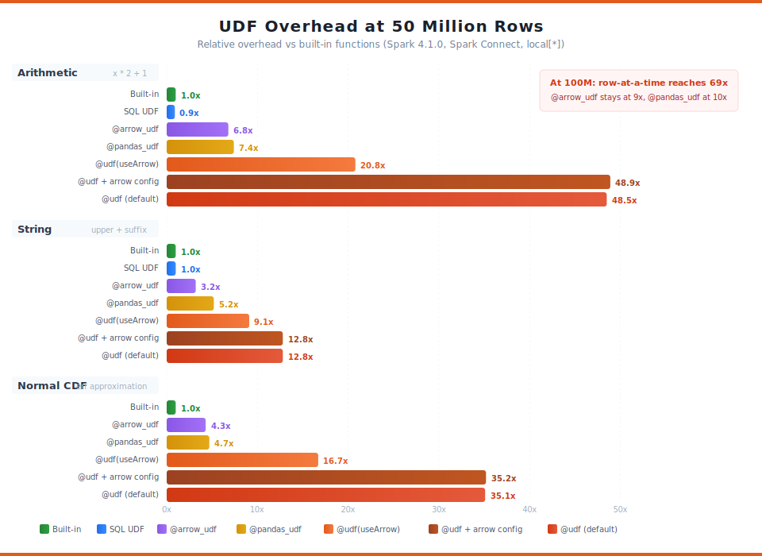
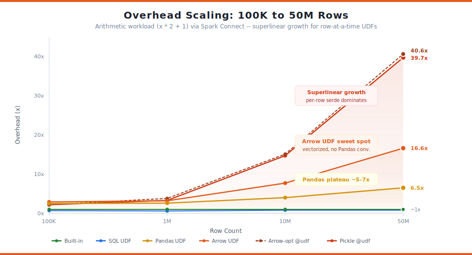

# Spark UDF Performance Benchmark

**Need custom Python logic in Spark? Here's what it costs and how to minimize it.**

Reproducible benchmark comparing the overhead of 7 PySpark UDF types across 3 workload complexity tiers, running on Spark Connect. The goal: help you choose the right UDF type for your use case.

## The Practical Question

Everyone starts with `@udf`. It works. But at scale, it hits **~49x overhead** vs built-in functions. The good news: you have options. The bad news: not all "Arrow" options are equal — and the naming in Spark 4.1 makes it easy to confuse three completely different things.

## Three Things Called "Arrow UDF" in Spark 4.1

Spark 4.1 uses the word "Arrow" for three distinct UDF mechanisms. They look similar in the docs but sit at completely different points on the performance spectrum:

| Mechanism | Decorator | What Python receives | Physical operator | Overhead |
|-----------|-----------|---------------------|-------------------|----------|
| **`@udf` + arrow config** | `@udf` + `arrow.pyspark.enabled=true` | Scalars (one row at a time) | `BatchEvalPython` | **~49x** |
| **`@udf(useArrow=True)`** | SPARK-43082 | Scalars (one row at a time) | `ArrowEvalPython` | **~9-21x** |
| **`@arrow_udf`** | SPARK-53014 | `pyarrow.Array` (entire batch) | `ArrowEvalPython` | **~3-7x** |

The first just changes the wire format (pickle → Arrow) but keeps the same row-at-a-time `BatchEvalPython` execution — zero improvement. The second changes the physical operator to `ArrowEvalPython` which batches transport but still iterates rows in Python — 2-2.4x improvement. The third is a genuinely new execution model where your function receives entire `pyarrow.Array` objects and can use `pyarrow.compute` for vectorized operations.

We verified `@arrow_udf` at 50M rows in Spark 4.1.0 — it is the fastest Python UDF option, beating `@pandas_udf` across all workloads (0.73s vs 0.79s arithmetic, 1.55s vs 2.51s string, 0.76s vs 0.82s CDF). See [results](#arrow_udf-results) below.

## Transport vs Execution: Why Arrow Config Doesn't Help @udf

UDF performance has two independent axes: **transport format** (how data moves between JVM and Python) and **execution model** (how Python processes each row). Most people conflate them.

<p align="center">
  
</p>

|  | Pickle Transport | Arrow Transport |
|---|---|---|
| **Row-at-a-time** | `@udf` (default) **~49x** | `@udf` + arrow config **~49x** |
| **Batch transport, scalar exec** | — | `@udf(useArrow=True)` **~9-21x** |
| **Vectorized batch** | — | `@pandas_udf` **~5-7x**, `@arrow_udf` **~3-7x** |

**Key insight:** Switching transport format from pickle to Arrow while keeping row-at-a-time execution gives you **48.5x vs 48.9x** — essentially zero difference. The bottleneck is per-row Python function calls, not serialization format. Arrow batches only help when paired with a different physical operator (`ArrowEvalPython`) or a vectorized execution model.

The physical operator matters more than the wire format:
- **`BatchEvalPython`** — used by default `@udf` (both pickle and arrow config). Per-row serde regardless of format. ~49x.
- **`ArrowEvalPython`** — used by `@udf(useArrow=True)`, `@pandas_udf`, and `@arrow_udf`. Batched Arrow transport. What your function *receives* determines the rest: scalars (~9-21x), Pandas Series (~5-7x), or PyArrow Arrays (~3-7x).

## Python UDF Comparison (50M rows)

If you need Python, which UDF type should you use?

<p align="center">
  
</p>

| UDF Type | Arithmetic | String | CDF |
|----------|-----------|--------|-----|
| `@udf` (default) | 5.20s | 6.22s | 6.18s |
| `@udf` + arrow config | 5.24s (1.0x) | 6.23s (1.0x) | 6.20s (1.0x) |
| `@udf(useArrow=True)` | 2.23s (**2.3x faster**) | 4.43s (**1.4x faster**) | 2.94s (**2.1x faster**) |
| `@pandas_udf` | 0.79s (**6.6x faster**) | 2.51s (**2.5x faster**) | 0.82s (**7.5x faster**) |
| `@arrow_udf` | 0.73s (**7.1x faster**) | 1.55s (**4.0x faster**) | 0.76s (**8.1x faster**) |

`@arrow_udf` is the fastest Python UDF option across all workloads. Switching from `@udf` to `@arrow_udf` saves **4.5 seconds per 50M rows** on arithmetic. `@pandas_udf` saves 4.4 seconds. `@udf(useArrow=True)` saves 3.0 seconds. Arrow config alone saves nothing.

## Decision Guide

```
Need custom logic in Spark?
│
├─ Can you express it in SQL?
│  └─ YES → SQL UDF (CREATE TEMPORARY FUNCTION)     ~1.0x  ← free
│
├─ Can you use built-in pyspark.sql.functions?
│  └─ YES → Built-in functions                      ~1.0x  ← free
│
├─ Need Python — can you use PyArrow compute?
│  └─ YES → @arrow_udf                              ~3-7x  ← fastest Python option
│
├─ Need Python — Pandas/NumPy?
│  └─ YES → @pandas_udf                             ~5-7x
│
├─ Need Python — per-row logic, can't vectorize?
│  └─ TRY → @udf(useArrow=True)                     ~9-21x ← 2x better than default
│
└─ Last resort
   └─ @udf (default)                                 ~49x
```

## Performance Hierarchy

Three tiers of execution speed, from JVM-native (free) to row-at-a-time Python (~49x overhead):

<p align="center">
  
</p>

## Overhead vs Built-in Functions (50M rows)

For reference, here's the full picture including JVM-native baselines. Note that the high multipliers (49x) reflect comparison against Tungsten-optimized built-ins — the absolute times (5.2s for 50M rows) may be perfectly acceptable for your workload.

<p align="center">
  
</p>

| UDF Type | Arithmetic | String | CDF | Trend |
|----------|-----------|--------|-----|-------|
| Built-in functions | 1.0x | 1.0x | 1.0x | Baseline |
| SQL UDFs | 0.9x | 1.0x | n/a | Same as built-in |
| `@arrow_udf` | 6.8x | 3.2x | 4.3x | Flat ~3-7x |
| `@pandas_udf` | 7.4x | 5.2x | 4.7x | Flat ~5-7x |
| `@udf(useArrow=True)` | **20.8x** | 9.1x | **16.7x** | Between vectorized and row-at-a-time |
| `@udf` + arrow config | **48.9x** | 12.8x | **35.2x** | Superlinear growth |
| `@udf` (default) | **48.5x** | 12.8x | **35.1x** | Superlinear growth |

## Overhead Scaling (100K to 50M Rows)

<p align="center">
  
</p>

> Full analysis across 100K, 1M, 10M, and 50M rows in [docs/report.md](docs/report.md).

## Quick Start

### Docker (fully reproducible, no local Spark needed)

```bash
# Run benchmark at 100K rows
docker compose run --rm benchmark --rows 100000

# Run at 50M rows
docker compose run --rm benchmark --rows 50000000

# Run tests
docker compose run --rm test
```

### Local (requires Spark 4.1 + Java 17)

```bash
# Install dependencies
pip install -e ".[dev]"

# Run tests (1K rows, ~10s)
make test

# Run benchmark at different scales
make bench-100k
make bench-1m
make bench-10m
make bench-50m
```

### Direct invocation

```bash
PYSPARK_PYTHON=python3 PYTHONPATH=src python -m spark_udf_benchmark \
    --rows 1000000 --warmup 1 --runs 3 --output-dir results/
```

## UDF Types Tested

| # | UDF Type | Code | Overhead | Wall-clock (arithmetic, 50M) |
|---|----------|------|---------|------------------------|
| 1 | Built-in functions | `pyspark.sql.functions` | 1.0x (baseline) | 0.11s |
| 2 | SQL UDFs | `CREATE TEMPORARY FUNCTION` | ~1x | 0.09s |
| 3 | `@arrow_udf` | `@arrow_udf(returnType)` (SPARK-53014) | ~3-7x | 0.73s |
| 4 | `@pandas_udf` | `@pandas_udf(returnType)` | ~5-7x | 0.79s |
| 5 | `@udf(useArrow=True)` | `@udf(returnType, useArrow=True)` (SPARK-43082) | ~9-21x | 2.23s |
| 6 | `@udf` + arrow config | `@udf` + `arrow.pyspark.enabled=true` | ~49x | 5.24s |
| 7 | `@udf` (default) | `@udf(returnType)` | ~49x | 5.20s |

> All results at 50M rows. Scala/Java UDFs excluded (require compiled JAR). Uses Spark Connect (`remote("local[*]")`) for all benchmarks.

## Workloads

| Workload | Expression | Complexity |
|----------|-----------|------------|
| arithmetic | `x * 2 + 1` | Trivial |
| string | `upper(x) + '_SUFFIX'` | Moderate |
| cdf | `0.5 * (1 + erf(x / sqrt(2)))` | Complex (Normal CDF) |

## Methodology

- All benchmarks run via Spark Connect (`SparkSession.builder.remote("local[*]")`)
- Each UDF applied via `df.withColumn("result", udf_expr)` then `.agg(F.count("result")).collect()` forces materialization (prevents Catalyst column pruning)
- 1 warmup run (discarded), 3 timed runs, report median
- Overhead = `median_duration / builtin_median_duration` per workload
- Synthetic data: `spark.range()` with 3 columns (`id: long`, `value: double`, `name: string`)

## Key Findings

1. **If you need Python, use `@arrow_udf`** — it is the fastest Python UDF option across all workloads (0.73s vs 0.79s arithmetic, 1.55s vs 2.51s string, 0.76s vs 0.82s CDF at 50M rows). `@pandas_udf` is the next best option when you need Pandas/NumPy APIs.
2. **`@arrow_udf` is especially strong on strings** — 1.6x faster than `@pandas_udf` (1.55s vs 2.51s) because `pyarrow.compute` avoids Pandas string overhead.
3. **`@udf(useArrow=True)` is a solid middle ground** — 2-2.3x faster than default `@udf` when you can't vectorize. Uses `ArrowEvalPython` for batched Arrow transport.
4. **Arrow transport config doesn't help `@udf`** — 48.5x vs 48.9x. Changes serialization format but keeps `BatchEvalPython`. The bottleneck is per-row Python calls, not how bytes are serialized.
5. **SQL UDFs are free** — they compile to Catalyst expressions, same as built-in functions.
6. **Row-at-a-time overhead is ~49x** — higher than previously reported, confirmed with 32GB driver memory and zero cache spill.

## `@arrow_udf` Results

The `@arrow_udf` decorator (SPARK-53014) is a genuinely new execution model — your function receives entire `pyarrow.Array` objects and can use the 200+ functions in `pyarrow.compute` for true vectorized processing:

```python
from pyspark.sql.functions import arrow_udf
import pyarrow as pa

@arrow_udf("double")
def double_it(x: pa.Array) -> pa.Array:
    return pa.compute.multiply(x, 2)  # vectorized, no per-row calls
```

Confirmed results at 50M rows (median of 3 runs, 32GB driver memory):

| UDF Type | Arithmetic | String | CDF |
|----------|-----------|--------|-----|
| `@arrow_udf` | 0.73s (6.8x) | 1.55s (3.2x) | 0.76s (4.3x) |
| `@pandas_udf` | 0.79s (7.4x) | 2.51s (5.2x) | 0.82s (4.7x) |
| `@udf(useArrow=True)` | 2.23s (20.8x) | 4.43s (9.1x) | 2.94s (16.7x) |

Key observations:
- **`@arrow_udf` is FASTER than `@pandas_udf` across ALL workloads** (0.73s vs 0.79s arithmetic, 1.55s vs 2.51s string, 0.76s vs 0.82s CDF)
- **`@arrow_udf` is especially strong on strings: 1.6x faster than `@pandas_udf`** (1.55s vs 2.51s) — `pyarrow.compute.utf8_upper` avoids Pandas string overhead
- **Both vectorized options are ~3x faster than `@udf(useArrow=True)`**, confirming the execution model (not just transport) is the key lever

## Project Structure

```
spark-udf-benchmark/
├── src/spark_udf_benchmark/
│   ├── __init__.py          # Package exports
│   ├── __main__.py          # CLI entry point
│   ├── benchmark.py         # UdfPipelineBenchmark class
│   └── result.py            # UdfBenchmarkResult dataclass
├── tests/
│   ├── conftest.py          # Spark Connect session fixture
│   └── test_benchmark.py    # 20 smoke tests (1K rows)
├── graphics/                # SVG visualizations
│   ├── 01_overhead_at_50m.svg
│   ├── 02_overhead_scaling.svg
│   ├── 03_performance_hierarchy.svg
│   ├── 04_python_udf_comparison.svg
│   └── 05_transport_vs_execution.svg
├── results/                 # Checked-in JSON from our runs
│   ├── 100k.json
│   ├── 1m.json
│   ├── 10m.json
│   └── 50m.json
├── docs/
│   └── report.md            # Full analysis with all scales
├── Dockerfile               # Spark 4.1.0 + Java 17 + Python 3.12
├── docker-compose.yml       # One-command execution
├── Makefile                 # make test / make bench-50m
└── pyproject.toml           # Dependencies and project config
```

## Environment

| Component | Version |
|-----------|---------|
| Apache Spark | 4.1.0 |
| Python | 3.12 |
| Java | 17 |
| PyArrow | 17-18 |
| pandas | 2.x |
| scipy | 1.12+ |
| Mode | Spark Connect |
| Driver memory | 32GB |

> Spark 4.1.0, Python 3.12, Spark Connect local[*], 32GB driver memory, 50M rows, median of 3 runs
